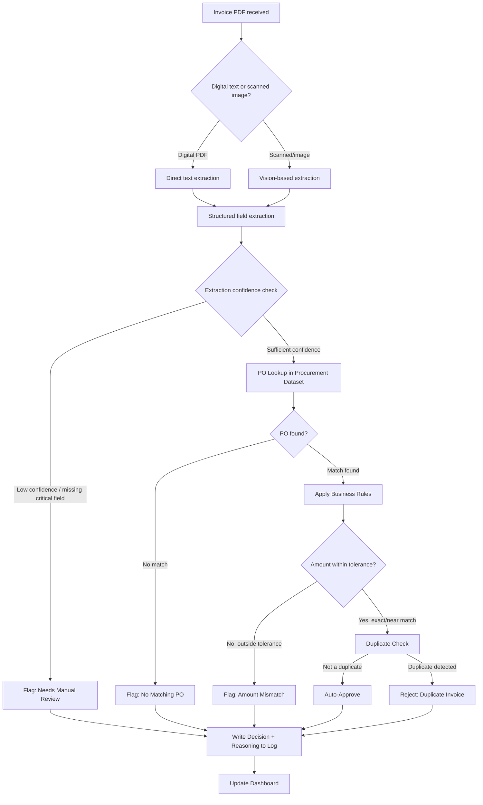

# PRD — AI-Powered Invoice-to-Decision Engine

**Case Study: Zamp AI Solutions Associate · PS-1 (Finance/AP)**

| Field | Value |
| --- | --- |
| Author | \[Your Name\] |
| Status | Draft — v1.0 |
| Date | \[Insert Date\] |
| Build window | Day 1 (this doc) → Day 6 (build) → Day 7 (submit) |

---

## 1. Executive Summary

AP teams at mid-size companies burn hundreds of hours a month manually opening vendor invoices, hunting for the matching PO, eyeballing the numbers, and deciding whether to pay, flag, or reject. The cost isn't just time — it's *inconsistent, unexplainable* decisions made by tired people at the end of a long week.

This MVP is an **Invoice-to-Decision Engine**: a process that ingests a raw invoice (PDF), extracts and validates its data, matches it against a purchase-order system, applies explainable business rules, and outputs one of three decisions — **Auto-Approve, Flag for Review, or Reject** — with full reasoning attached at every step.

The build is scoped to run end-to-end on real (synthetic) inputs, handle 4 deliberately-chosen edge cases, and expose a live run view + dashboard so the logic is inspectable, not a black box.

---

## 2. Problem Statement

AP processing today is a single person doing four jobs at once, per invoice:

1. **Reader** — extract the numbers from an inconsistent PDF.
2. **Detective** — find the matching PO in a separate system.
3. **Auditor** — check the math and the policy tolerances.
4. **Decision-maker** — approve, escalate, or reject, and be able to justify it later.

Each of these is individually automatable; the hard part — and the actual product problem — is **handling the disagreement between steps gracefully**. A good system doesn't just extract fields; it knows *when its own extraction is unreliable*, *when a "close enough" match isn't actually close enough*, and *when to stop and ask a human* instead of guessing.

That judgment is the core deliverable of this MVP — not the extraction itself.

---

## 3. Goals & Success Metrics

### 3.1 Business goals (why this MVP, for Zamp specifically)

- Demonstrate a process directly aligned to Zamp's real product surface (procure-to-pay / AP automation), not a generic demo.
- Prove the candidate can turn an ambiguous operational problem into a scoped, explainable, working system in under a week.

### 3.2 User goals (the AP clerk / AP manager)

- Stop manually cross-referencing PDFs against spreadsheets.
- Trust the system's decision because the reasoning is visible, not hidden behind a score.
- See a full audit trail for every invoice, for compliance and dispute resolution.

### 3.3 Success metrics for the MVP

| Metric | Target |
| --- | --- |
| End-to-end runs without manual intervention | 100% of happy-path runs |
| Edge cases handled with correct, distinct behavior | 4/4 |
| Decision explainability | Every decision cites the specific rule(s) / fields that drove it |
| Extraction accuracy on synthetic test set | ≥ 90% field-level accuracy on clean PDFs; degraded-but-flagged (not silently wrong) on scanned PDFs |
| Time to process one invoice | \< 15 seconds, visible in the live run view |
| Live demo reliability | Zero unrecovered failures during rehearsed run |

---

## 4. Scope

### 4.1 In scope (MVP)

- PDF ingestion (digital-text and scanned/image PDFs)
- Field extraction (vendor, invoice #, date, line items, tax, total, PO reference)
- PO dataset lookup and matching (single JSON/CSV "procurement system" stand-in)
- Business-rule engine: tolerance thresholds, duplicate detection, split-PO handling
- Three-way decision output with reasoning trail
- Live run view (per-stage progress) + dashboard (run history, status breakdown)
- 4 hand-built edge cases

### 4.2 Out of scope (post-MVP)

- Real email ingestion / inbox integration
- Multi-currency, multi-entity consolidation
- Real ERP/procurement system integration (mocked instead)
- Learning/feedback loop from human corrections (noted as a v2 idea, not built)
- User authentication / multi-tenant support

---

## 5. Users & Personas

| Persona | Need | How the MVP serves them |
| --- | --- | --- |
| **AP Clerk** (primary operator) | Wants invoices triaged so they only touch the ones that need a human | Auto-approve removes clean cases from their queue entirely |
| **AP Manager** (reviewer/approver) | Needs to trust *why* something was flagged, fast | Reasoning trail + dashboard filters by flag reason |
| **Auditor / Compliance** | Needs a record of every decision and its basis | Full run log persisted per invoice, timestamped |
| **Hiring evaluator** (this case study's real audience) | Needs to see judgment, not just automation | Explainability and edge-case handling are first-class, not bolted on |

---

## 6. User Stories

- As an AP clerk, I upload an invoice and immediately see which stage it's in (extracting → matching → deciding) so I'm not staring at a spinner.
- As an AP manager, when an invoice is flagged, I can see exactly which rule triggered it and the two numbers that didn't reconcile.
- As an auditor, I can pull up any past invoice and see its full decision trail, including the raw extracted data before any rule was applied.
- As a hiring evaluator, I can feed in a new invoice I've never seen before and watch the system reason through it live.

---

## 7. Process Flow

---

## 8. Functional Requirements

### 8.1 Ingestion

- Accept a PDF file upload (or a folder/queue of PDFs for batch demo).
- Detect PDF type: text-layer present vs. scanned image (no text layer).
- Log ingestion timestamp and file metadata.

### 8.2 Extraction

- **Text-native path**: parse the embedded text layer directly.
- **Scanned path**: use a vision-capable model to read the invoice image and extract the same structured fields.
- Extract: vendor name, invoice number, invoice date, PO reference (if present), line items (description, qty, unit price), subtotal, tax, total.
- Attach a **confidence signal** per field — not just a raw extraction. If a critical field (total, vendor, or PO ref) can't be extracted with reasonable confidence, this is itself a routing decision, not a failure.

### 8.3 Validation

- Check required fields are present.
- Check arithmetic: line items + tax = total (within rounding tolerance).
- Normalize vendor name and currency for downstream matching.

### 8.4 PO Matching

- Look up the referenced PO in the procurement dataset.
- If no explicit PO reference, attempt fuzzy match on vendor + amount + date proximity.
- Handle the case where one PO has been split across multiple invoices (partial fulfillment) — track cumulative invoiced amount against the PO's total.

### 8.5 Decision Engine

- Apply rules in a fixed, explainable order (see §9).
- Every rule that fires appends a human-readable reason to the decision trail — never a silent branch.
- Final state is always one of: `AUTO_APPROVED`, `FLAGGED_FOR_REVIEW`, `REJECTED`, each with a sub-reason code.

### 8.6 Output & Audit Trail

- Persist: raw extracted data, matched PO (if any), rules evaluated and their outcomes, final decision, timestamp.
- Every run is replayable from the dashboard — you can re-open any past invoice and see the full trail, not just the final verdict.

---

## 9. Business Rules & Decision Logic

| Rule | Condition | Outcome |
| --- | --- | --- |
| Critical field missing | Vendor, total, or invoice number unextractable | `FLAGGED_FOR_REVIEW` — "Low-confidence extraction" |
| No PO match | No PO found by reference or fuzzy match | `FLAGGED_FOR_REVIEW` — "No matching PO" |
| Amount within tolerance | \` | invoice_total − PO_amount |
| Amount outside tolerance | Exceeds tolerance band | `FLAGGED_FOR_REVIEW` — "Amount mismatch: invoice $X vs PO $Y" |
| Split-PO cumulative exceeds PO total | Sum of invoices against a PO > PO amount (+tolerance) | `FLAGGED_FOR_REVIEW` — "Cumulative invoiced exceeds PO" |
| Duplicate detected | Same vendor + invoice number (or same vendor + amount + date) already processed | `REJECTED` — "Duplicate invoice" |
| All checks pass | — | `AUTO_APPROVED` |

Tolerance values, matching thresholds, and duplicate-detection windows should be **configurable constants**, not hardcoded magic numbers — this is a detail worth surfacing explicitly in the demo, since it shows you understand these are business decisions, not engineering ones.

---

## 10. Edge Cases (MVP scope: 4)

| # | Edge case | Why it matters | Expected behavior |
| --- | --- | --- | --- |
| 1 | **Scanned, low-quality invoice** (image PDF, skewed/noisy) | Real vendor invoices aren't all clean text PDFs | Routes to vision-extraction path; if confidence is low on a critical field, flags for review rather than guessing silently |
| 2 | **Split PO across multiple invoices** | Common in real procurement (partial deliveries/milestone billing) | System tracks cumulative invoiced amount per PO across multiple runs and only flags once the cumulative total breaches tolerance |
| 3 | **Amount just outside tolerance** (e.g., PO $10,000, invoice $10,310, 3% over a 2% threshold) | Distinguishes "close enough" from "needs a human," the crux of the whole problem | Flags with the exact delta shown, not a generic "mismatch" |
| 4 | **Duplicate invoice submission** (same invoice re-sent, or resubmitted with a cosmetic change) | Prevents double-payment — real fraud/error vector | Detected via vendor + invoice number/amount+date fingerprint; rejected with the original invoice referenced |

*(A 5th optional edge case — missing PO reference entirely, resolved via fuzzy match — is a strong stretch addition if time allows, since it best demonstrates matching logic that goes beyond exact lookup.)*

---

## 11. Data Model

**Invoice** — `id, vendor_name, invoice_number, invoice_date, po_reference, line_items[], subtotal, tax, total, source_file, extraction_confidence, raw_text/image_ref`

**PurchaseOrder** — `po_id, vendor_name, po_amount, po_date, status, cumulative_invoiced`

**Vendor** — `vendor_id, name, approved (bool), aliases[]`

**Decision** — `invoice_id, status (auto_approved/flagged/rejected), reason_code, reason_detail, rules_evaluated[], timestamp`

**RunLog** — `run_id, invoice_id, stage, stage_status, duration_ms, timestamp` (this powers the live run view)

---

## 12. System Architecture & Tech Stack

Recommended stack (any of the case study's allowed tools would work — this is the pick optimized for an AI-native build in a one-week window):

| Layer | Choice | Why |
| --- | --- | --- |
| Extraction & reasoning | Claude API (vision-capable model) | One model handles both text-native and scanned PDFs, and can output structured JSON directly — avoids stitching together a separate OCR library |
| Backend / orchestration | Python (FastAPI) | Fast to wire rules + API calls; easy to expose as a simple REST API for the frontend |
| Business rules engine | Plain Python module, not a black-box "AI decides everything" | Keeps decisions deterministic and explainable — critical for the demo narrative |
| Data store | SQLite (file-based, zero setup) | No infra overhead for an MVP; trivially upgradable to Postgres later |
| Frontend | Lightweight React app (or a single HTML/JS page) | Needs to show a *live* run view — polling or a simple websocket from the backend as each stage completes |
| Deployment | Local run + optionally deployed via Render/Vercel for a shareable link | Case study asks for a link that's "live and runnable" |

**Alternative low-code path**: n8n or Make could orchestrate the same pipeline (webhook → Claude API node → rules via code node → DB write → dashboard), which is faster to wire but slightly harder to make the "live run view" feel polished. Recommended only if time is very tight.

---

## 13. UI/UX Requirements

**Live Run View** (shown during processing of a single invoice)

- Visual stepper: Ingest → Extract → Validate → Match PO → Apply Rules → Decision
- Each stage lights up as it completes, with its output shown inline (e.g., extracted fields appear as soon as extraction finishes)
- Final decision shown with a colored status (green/yellow/red) and the reasoning trail underneath

**Dashboard** (shown across all runs)

- Table of all processed invoices: vendor, amount, status, timestamp
- Filter by status (Approved / Flagged / Rejected)
- Click-through to any invoice's full run detail (re-renders the live run view, read-only)
- Simple summary stats: total processed, % auto-approved, most common flag reason

Design bar: clean and legible over polished. A well-organized table and a clear stepper will read as "product-minded" without needing custom illustration work.

---

## 14. Non-Functional Requirements

- **Explainability**: no decision should ever be un-traceable to a specific rule or extracted field.
- **Determinism**: given the same input twice, the same decision should result (extraction may use an LLM; the *rules* must not be probabilistic).
- **Graceful degradation**: low-confidence extraction should route to review, never silently proceed as if confident.
- **Latency**: single-invoice processing should complete in well under the live-demo's patience window (\~15s).

---

## 15. Test Data Plan

- Generate 6–10 synthetic invoice PDFs: a mix of clean digital-text invoices and 1–2 intentionally scanned/rasterized ones (to exercise the vision path).
- Generate a matching PO dataset (JSON/CSV, \~10–15 POs) with a few approved vendors.
- Deliberately construct the 4 edge-case inputs listed in §10 as their own named test files, separate from the happy-path set, so they can be run individually and rehearsed for the live demo.

---

## 16. Build Plan (mapped to case study schedule)

| Day | Focus |
| --- | --- |
| Day 2 | Data model + PO dataset + synthetic invoice generation; backend skeleton |
| Day 3 | Extraction pipeline (text-native path first, then vision path) |
| Day 4 | Rules engine + decision logic; happy path working end-to-end |
| Day 5 | Build and wire in the 4 edge cases one at a time; dashboard + live run view |
| Day 6 | Polish UI, rehearse demo runs, record the 5-minute video |
| Day 7 | Submit process link + video |

---

## 17. Risks & Mitigations

| Risk | Mitigation |
| --- | --- |
| Vision extraction is unreliable on messy scans | Treat low confidence as a first-class flagged outcome, not a bug to hide |
| Rules engine becomes an unexplainable pile of if/else | Keep rules as a small, ordered, named list (§9) — each with one clear reason string |
| Live demo breaks on an untested input | Rehearse the exact edge-case files in advance; never demo with a brand-new unseen file live unless it's the evaluator's own test |
| Scope creep (trying to handle every possible edge case) | Hard cap at 4 well-chosen edge cases per the brief — depth over breadth |

---

## 18. Assumptions Log

- Tolerance threshold set at 2% or $25 (whichever is greater) — a reasonable, disclosed default, not a hidden constant.
- "PO system" is simulated via a static dataset rather than a live integration, per the FAQ's explicit allowance.
- Duplicate detection window is unbounded within the demo dataset (in production this would be time-boxed, e.g., 90 days).

---

## 19. Demo Script Outline (5-minute video)

1. **(30s)** One-sentence framing of the problem and what the process does.
2. **(90s)** Run the happy path live — narrate each stage as it lights up.
3. **(2 min)** Run 1–2 edge cases live — narrate *why* the system behaves differently, pointing at the specific rule/reason.
4. **(60s)** Show the dashboard — history, filters, and one click-through to a past decision's full trail.
5. **(20s)** One sentence on what you'd build next (e.g., the human-feedback loop, real ERP integration).

---

## 20. Future Roadmap (explicitly post-MVP)

- Human-in-the-loop correction feedback that improves extraction confidence calibration over time.
- Multi-currency and multi-entity support.
- Real email/inbox ingestion instead of manual upload.
- Live procurement system integration (replacing the static PO dataset).